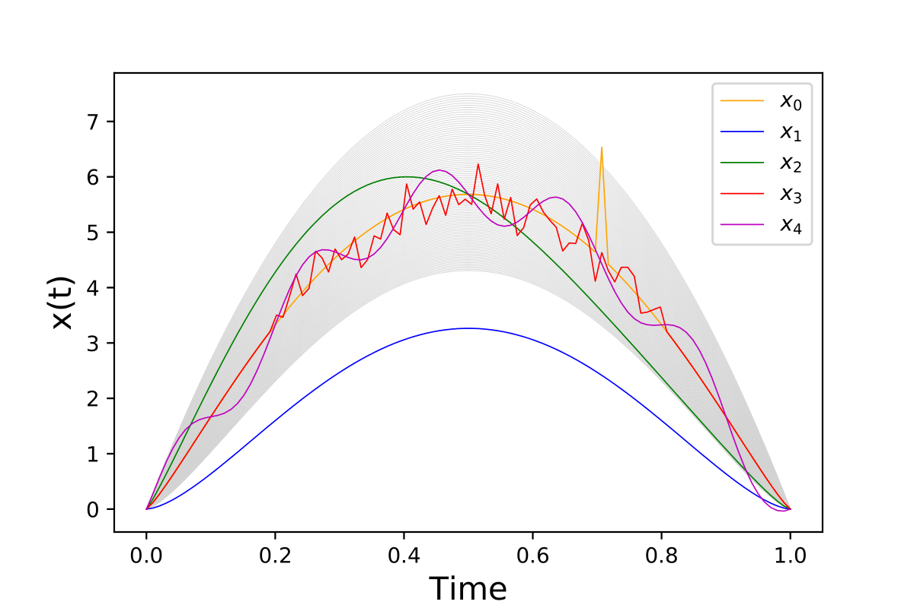

FIF : Functional Isolation Forest
=========================================

This repository hosts Python code of the Functional Isolation Forest algorithm. Here we provide the source code using cython/c++ and the old version in python. The c++ code is highly inspired from the incredible work of https://github.com/sahandha/eif and is ~40x times faster than the python version.

=========================================

Installation
------------

To get the latest version of the code::
.. code:: python

   pip install fif

or 
.. code:: python
   git clone https://github.com/Gstaerman/FIF.git
  
Algorithm
---------
Functional Isolation Forest is an anomaly detection (and anomaly ranking) algorithm for functional data.
It shows a great flexibility to distinguish most of anomaly types of functional data.

Some parameters have to be set by the user : 
                                    - X [numpy array of size (n,dim)]
                                    - time [numpy array of size dim]: vector time of discretization points.
                                    - sample_size [int]: the size of samples used for each tree.
                                    - ntrees[int]: the number of trees, default value is 100.
                                    - alpha[float between 0 and 1]: convex combination parameter for the innerproduct (as it is explained in the paper), default value is 1. 
                                    - dic_number [int: 0,1,2]: three dictionaries are implemented (0: Brownian motion; 1: Gaussian wavelets; 2: cosine), default value is 1.
                                    
See the documentation of FIF.py to get more informations on innerproduct and dictionary possibilities.                                 

Quick Start :
------------

Create a toy dataset :

.. code:: python

  import numpy as np 
  np.random.seed(42)
  m =100
  n =100
  tps = np.linspace(0,1,m)
  v = np.linspace(1,1.4,n)
  X = np.zeros((n,m))
  for i in range(n):
      X[i] = 30 * ((1-tps) ** v[i]) * tps ** v[i]

  Z1 = np.zeros((m))
  for j in range(m):
      if (tps[j]<0.2 or tps[j]>0.8):
          Z1[j] = 30 * ((1-tps[j]) ** 1.2) * tps[j] ** 1.2 
      else:
          Z1[j] = 30 * ((1-tps[j]) ** 1.2) * tps[j] ** 1.2 + np.random.normal(0,0.3,1)
  Z1[0] = 0
  Z1[m-1] = 0

  Z2 = 30 * ((1-tps) ** 1.6) * tps ** 1.6

  Z3 = np.zeros((m))
  for j in range(m):
      Z3[j] = 30 * ((1-tps[j]) ** 1.2) * tps[j] ** 1.2 + np.sin(2*np.pi*tps[j])

  Z4 = np.zeros((m))
  for j in range(m):
      Z4[j] = 30 * ((1-tps[j]) ** 1.2) * tps[j] ** 1.2

  for j in range(70,71):
      Z4[j] += 2

  Z5 = np.zeros((m))
  for j in range(m):
      Z5[j] = 30 * ((1-tps[j]) ** 1.2) * tps[j] ** 1.2 + 0.5*np.sin(10*np.pi*tps[j])

  X = np.concatenate((X,Z1.reshape(1,-1),Z2.reshape(1,-1),  
                       Z3.reshape(1,-1), Z4.reshape(1,-1), Z5.reshape(1,-1)), axis = 0)

   
And then use FIF to ranking functional dataset :

.. code:: python

  import fif as FIF
  np.random.seed(42)
  F  = FIF.FIForest(X, time, ntrees=100, sample_size=64, dic_number=1, alpha=0.5, seed=0)
  S  = F.compute_paths()
    
The simulated dataset with the five introduced anomalies (top). The sorted dataset (middle), the darker the color, the more the curves are considered anomalies. The sorted anomaly score of the dataset (bottom). 

.. image:: anomaly_example_rank-1.png
.. image:: anomaly_example_score-1.png

Dependencies
------------

These are the dependencies to use FIF:

* numpy 
* cython

Cite
----

If you use this code in your project, please cite::

   @InProceedings{staerman2019functional,
    title={Functional Isolation Forest},
    author={Guillaume Staerman and Pavlo Mozharovskyi and Stephan Cl\'emen\c con and Florence d'Alch\'e-Buc},
    year={2019},
    booktitle={Asian Conference of Machine Learning}
    }

  
