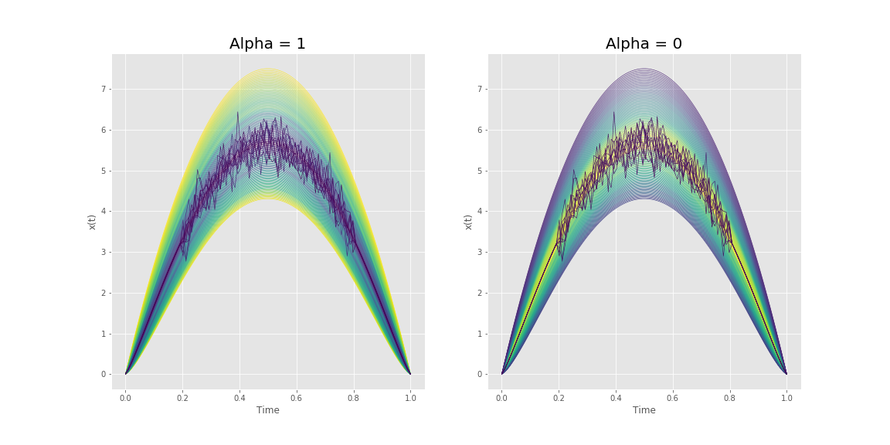

FIF : Functional Isolation Forest
=========================================

This repository hosts Python code of the Functional Isolation Forest algorithms and its extension to Multivariate functional data. Here we provide the source code for the algorithms as well as example notebooks to help get started.

=========================================

Installation
------------

To get the latest version of the code::

  $ git clone https://github.com/Gstaerman/FIF.git
  
Algorithm
---------
Functional Isolation Forest is an anomaly detection (and anomaly ranking) algorithm for functional data.
It shows a great flexibility to distinguish most of anomaly types of functional data.

Some parameters have to be set by the user : 
                                    - innerproduct (one can fix 'auto' and vary alpha parameter to play with FIF) 
                                    - D (Dictionary)
                                    - time (vector time of discretization points) 
                                    
See the documentation of FIF.py to get more informations on innerproduct and dictionary possibilities.                                 

Quick Start :
------------

Create a toy dataset :

.. code:: python
   
   import numpy as np
   m =100
   n =100
   tps = np.linspace(0,1,m)
   v = np.linspace(1,1.4,n)
   X = np.zeros((n,m))
   Y = np.zeros((10,m))
   for i in range(n):
   X[i] = 30 * ((1-tps) ** v[i]) * tps ** v[i]
   for i in range(10):
       for j in range(m):
           if (tps[j]<0.2 or tps[j]>0.8):
               Y[i,j] = 30 * ((1-tps[j]) ** 1.2) * tps[j] ** 1.2 
           else:
               Y[i,j] = 30 * ((1-tps[j]) ** 1.2) * tps[j] ** 1.2 + np.random.normal(0,0.3,1)
   Y[:,0] = 0
   Y[:,m-1] = 0
   Z = np.concatenate((X,Y), axis = 0)
   
And then use FIF to ranking functional dataset :

.. code:: python

   F1  = FIForest(Z, D="Brownian", time=tps, innerproduct="auto", alpha=1)
   S1  = F1.compute_paths()
   F2  = FIForest(Z, D="Brownian", time=tps, innerproduct="auto", alpha=0)
   S2  = F2.compute_paths()
    
S1 and S2 are the score of all functions in the dataset. S1 come from FIF with L2 scalar product while
S2 come from FIF with L2 derivate scalar product. Anomaly score increases from magenta to yellow in the left plot and decreases in the right plot.

Dependencies
------------

These are the dependencies to use FIF:

* numpy 

Cite
----

If you use this code in your project, please cite::

   Functional Isolation Forest   
   Guillaume Staerman, Pavlo Mozharovskyi, Stéphan Clémençon, Florence d'Alché-Buc. 
   (submitted), 2019.
   https://arxiv.org/abs/1904.04573 

  
