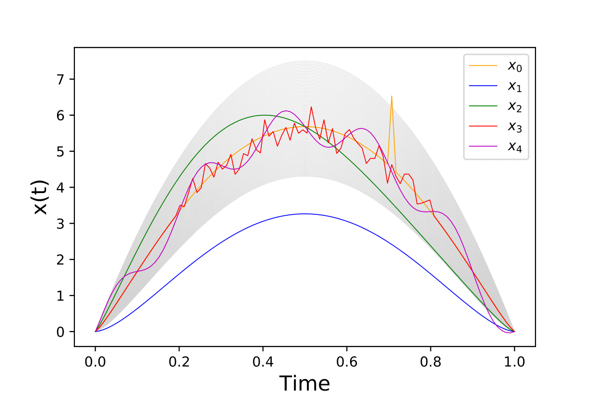
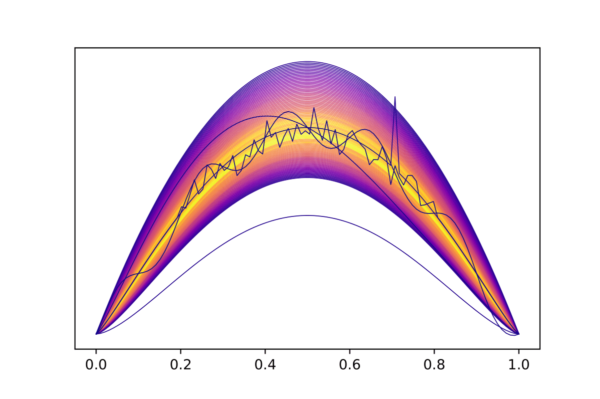
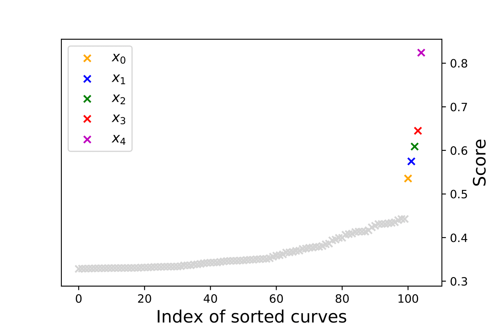

FIF : Functional Isolation Forest
=========================================

This repository hosts Python code of the Functional Isolation Forest algorithm: https://proceedings.mlr.press/v101/staerman19a. Here we provide the source code using cython/c++ and the old version in python. The c++ code is highly inspired from the incredible work of https://github.com/sahandha/eif and is extremly faster than the python version. Three dictionaries are implemented, Brownian motion, gaussian wavelets and cosine, see the paper for more details. Feel free to suggests any additional dictionaries. 

=========================================

Installation
------------
Download this repository and then run this python command in the folder:

.. code:: python

   python setup.py build_ext --inplace
   
Further, you can import the algorithm with the following command in your python script:

.. code:: python

   import fif as FIF
  
NB: our algorithm is not the one from https://pypi.org/project/fif/. Uninstall this package if you want to use functional isolation forest

Algorithm
---------
Functional Isolation Forest is an anomaly detection (and anomaly ranking) algorithm for functional data (i.e., time-series).
It shows a great flexibility to distinguish most of anomaly types of functional data.

The algorithm return the anomaly score of each sample with the function compute_paths(), see notebooks for example or the quick start below.

Some parameters have to be set by the user : 
                                    - X [numpy array of size (n,dim)]: 'n' functional data with 'dim' measurements. 
                                    - time [numpy array of size dim]: vector of times measurements of size 'dim'.
                                    - sample_size [int]: the size of samples used for each tree.
                                    - ntrees [int]: the number of trees, default value is 100.
                                    - alpha [float between 0 and 1]: convex combination parameter for the innerproduct (as it is explained in the paper), default value is 1. 
                                    - dic_number [int: 0,1,2]: three dictionaries are implemented (0: Brownian motion; 1: Gaussian wavelets; 2: cosine), default value is 1.
                                                                   

Quick Start :
------------

Create a toy dataset :

.. code:: python

  import numpy as np 
  np.random.seed(42)
  m =100;n =100;tps = np.linspace(0,1,m);v = np.linspace(1,1.4,n)
  X = np.zeros((n,m))
  for i in range(n):
      X[i] = 30 * ((1-tps) ** v[i]) * tps ** v[i]
  Z1 = np.zeros((m))
  for j in range(m):
      if (tps[j]<0.2 or tps[j]>0.8):
          Z1[j] = 30 * ((1-tps[j]) ** 1.2) * tps[j] ** 1.2 
      else:
          Z1[j] = 30 * ((1-tps[j]) ** 1.2) * tps[j] ** 1.2 + np.random.normal(0,0.3,1)
  Z1[0] = 0
  Z1[m-1] = 0
  Z2 = 30 * ((1-tps) ** 1.6) * tps ** 1.6
  Z3 = np.zeros((m))
  for j in range(m):
      Z3[j] = 30 * ((1-tps[j]) ** 1.2) * tps[j] ** 1.2 + np.sin(2*np.pi*tps[j])

  Z4 = np.zeros((m))
  for j in range(m):
      Z4[j] = 30 * ((1-tps[j]) ** 1.2) * tps[j] ** 1.2

  for j in range(70,71):
      Z4[j] += 2

  Z5 = np.zeros((m))
  for j in range(m):
      Z5[j] = 30 * ((1-tps[j]) ** 1.2) * tps[j] ** 1.2 + 0.5*np.sin(10*np.pi*tps[j])

  X = np.concatenate((X,Z1.reshape(1,-1),Z2.reshape(1,-1),  
                       Z3.reshape(1,-1), Z4.reshape(1,-1), Z5.reshape(1,-1)), axis = 0)

   
And then use FIF to rank functional dataset :

.. code:: python

  import fif as FIF
  F  = FIF.FIForest(X, time=tps, ntrees=100, sample_size=64, dic_number=1, alpha=0.5, seed=0)
  Anomaly_score  = F.compute_paths()
    
The simulated dataset with the five introduced anomalies (top). The sorted dataset (middle), the darker the color, the more the curves are considered anomalies. The sorted anomaly score of the dataset (bottom). 

Dependencies
------------

These are the dependencies to use FIF:

* numpy 
* cython

Cite
----

If you use this code in your project, please cite::

   @InProceedings{pmlr-v101-staerman19a,
  title = 	 {Functional Isolation Forest},
  author =       {Staerman, Guillaume and Mozharovskyi, Pavlo and Cl\'emen\c{c}on, Stephan and d'Alch\'e-Buc, Florence},
  booktitle = 	 {Proceedings of The Eleventh Asian Conference on Machine Learning},
  pages = 	 {332--347},
  year = 	 {2019},
  volume = 	 {101},
  publisher =    {PMLR}
   }

  
